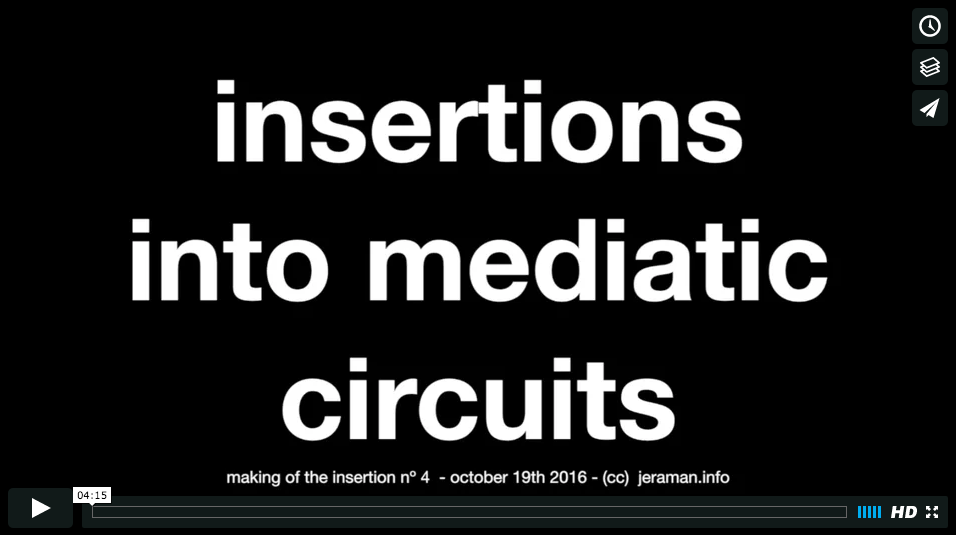

#Insertions into Mediatic Circuits

>_1) There are in society certain mecanisms for circulation (circuits);_
>
>_2) These circuits clearly reflect the ideology of the producer, but at the same time it is possible they could receive insertions while they circulate;_
>
>_3) This always happen whenever someone starts it._
> 
> Cildo Meireles, 1970.

"Insertions into Mediatic Circuits" are a series of media interventions (here called insertions) where live streams from the internet are downloaded, copied, manipulated, and finally streamed back to the internet in realtime. The new stream is almost identical to the original one, except for the insertion itself. The process is transparent to the media viewer. 

The project is possible due to a custom software framework implemented by the author. This framework is open source and intended to be a creative platform for critical artists and activists. 

Project was conceived and developed by Jeraman, initiated in 2016.

##Motivation
This project motivates me because it allows me to explore three particular questions:

1. Considering that the "medium is the message" (i.e. the medium embeds the ideology of the producer), how can we subvert the original ideology of the producer, aiming at more diverse, fair, and critical media?

2. Considering the power of (political, social, entertaining... affective) mediated experiences in our society, which are instantaneously shared as soon as they happen with almost no critical ponderation about their meanings, origins, and purpose, what would be the impact of such insertions?

3. I believe that all creations somehow embed the ideology of their creators, and technology is not different. How can we deconstruct this idea that technology is "neutral" and "coding" is not a political act?

##Examples

###[Insertion n. 1] Fora Temer

###[Insertion n. 2] Solta a batida aê, cumpadi!

###[Insertion n. 3] Trump: "I'll make racism great again" 

###[Insertion n. 4] Final presidential debate - Clinton vs. Trumlolo 

##References
[Inserções em Circuitos Ideológicos](https://passantes.redezero.org/reportagens/cildo/inserc.htm), by Cildo Meireles, 1970.

[Crepúsculo dos Ídolos](https://jarbasjacome.wordpress.com/crepusculo-dos-idolos/), by Jarbas Jácome, 2008.

[Newstweek](https://julianoliver.com/output/newstweek), by Julien Oliver and Daniil Vasiliev, 2011.

[Image Fulgurator](https://juliusvonbismarck.com/bank/index.php?/projects/image-fulgurator/2/), by Julius Von Bismark, 2007.

--
[Jeraman](https://jeraman.info), 2016.
